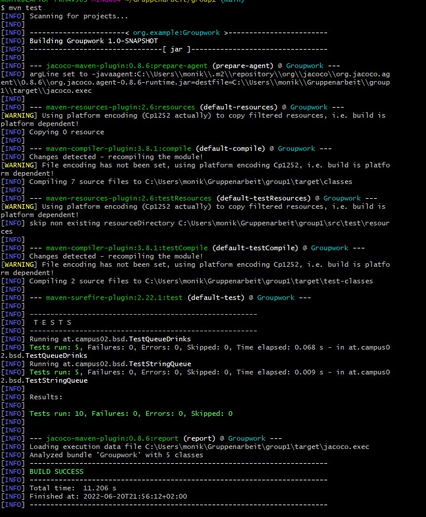

[08:02] Grabner-Haider Julia
# Team Work
### Projectname
[groupwork_MP_JGH](https://github.com/MonikaP-28/JuliaAndMonika.git)

### Group members
* Monika Popic
* Julia Grabner-Haider

## Overview
## Features
### Implementation
- [x] MP - Create new repository on GitHub
- [x] MP - Invite group member as collaborator

#### Maven Project
- [x] MP - Create new Maven-Project in repository folder and integrate two submissions from Moodle
- [x] MP - Create package - at.C02.bsd
- [x] MP - Create .gitignore file
- [x] MP - Put the starting version of your colleagues on GitHub

#### README File
- [x] JGH - Create README
- [x] JGH - Read exercise instructions
- [x] JGH - Create list with all exercise
- [x] JGH - Make the changes available to colleagues

#### POM File
- [x] MP - Expand pom.xml
- [x] JGH & MP - Add your developer informations

#### Errors
- [x] MP - Correct three errors you should have
- [x] MP - Set error correction in your own branch and merge the result back
- [x] MP - Make changes available to colleagues and don't forget to update the tasklist

#### the three Errors
- there was an "s" in the last line of the document
- in method "remove" one line was removed
- in method "poll" changed elements.size()>0

#### NEW Implementation
- [x] MP & JGH - Create parallel to current Version a new implementation
- [x] MP - Integrate the "Drinks" - Interface and implementing class in the project
- [x] JGH - Create queue version they will enables "Drinks" to manage in queue
- [x] MP & JGH - Share the methods specified by interface, so every group member create the same number of methods. Set parts in your own branch
- [x] JGH - Add JavaDoc commentary for the current classes and for the new variants
- [x] MP & JGH - Make the changes available to your colleagues

#### Tests
- [x] MP & JGH - Create test methods to have a hundred percent for the existing implentation to recive all test cover
- [x] MP & JGH - Create a further test file and test the new "Drinks" version with a class you choose - Reach a 100 % test cover
- [x] MP & JGH - Write in the JavaDoc & comments how to do what aspect testing
- [x] MP - Split testing within the group and implement in Branch
- [x] - Error-free call via command line

- [x] MP & JGH - Changes are made available to colleagues

#### Maven site documentation 
- [x] MP & JGH - Integrate and adapt general project information, test statistics and also the generated API documentation.
- [x] JGH & MP - insert one Markdown file per member (description of the contributions during the implementation of the project)
- [x] MP & JGH - Error-free call via command line 

